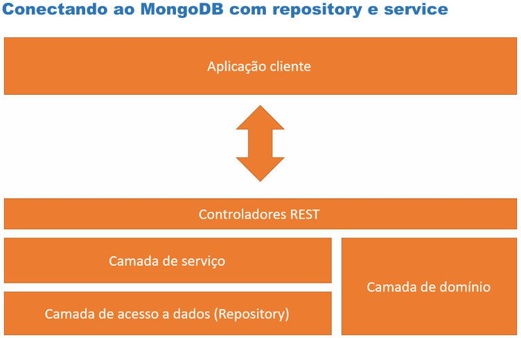
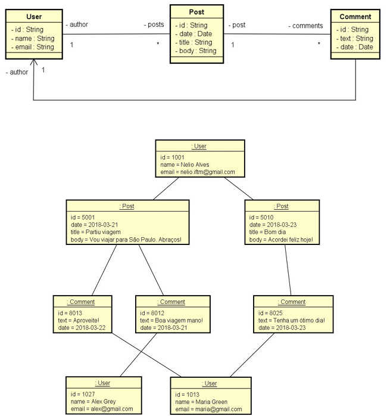
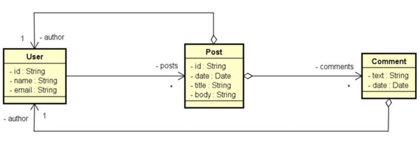

<h1 align="center">🔗 Projeto MongoDB com Spring Boot e Spring Data (MongoRepository)</h1>

<h2 align="center">Curso Udemy: Programação Orientada a Objetos com Java</h2>

Este projeto faz parte do curso de Programação Orientada a Objetos com Java, ministrado na Udemy. O objetivo principal foi criar uma aplicação web utilizando Spring Boot e Spring Data para MongoDB, estruturando o sistema em camadas lógicas e implementando operações básicas de CRUD (Create, Retrieve, Update, Delete). Durante o desenvolvimento, foram exploradas as principais diferenças entre o paradigma orientado a documentos e o relacional, além da implementação de associações entre objetos, utilizando objetos aninhados e referências. Também foram realizadas consultas eficientes com Spring Data e MongoRepository, refletindo sobre as melhores decisões de design para um banco de dados orientado a documentos.

## 📌 Objetivo geral:
- Compreender as principais diferenças entre paradigma orientado a documentos e relacional 
- Implementar operações de CRUD 
- Refletir sobre decisões de design para um banco de dados orientado a documentos 
- Implementar associações entre objetos 
  - Objetos aninhados 
  - Referências
- Realizar consultas com Spring Data e MongoRepository

## Arquitetura de Conexão ao MongoDB com Padrões Repository e Service



Este diagrama ilustra a arquitetura de conexão de uma aplicação ao MongoDB, utilizando os padrões de Repository e Service. A arquitetura está organizada em várias camadas que representam diferentes componentes do sistema:

1. **Aplicação Cliente**: Interface de usuário que interage com a aplicação.
2. **Controladores REST**: Pontos de entrada da aplicação que tratam as requisições HTTP e delegam para a camada de serviço.
3. **Camada de Serviço**: Contém a lógica de negócios e interage com a camada de acesso a dados.
4. **Camada de Acesso a Dados (Repository)**: Responsável por acessar e manipular os dados no MongoDB.
5. **Camada de Domínio**: Representa os modelos de dados e entidades do sistema.

O diagrama destaca a comunicação entre a aplicação cliente e os controladores REST, bem como a interação entre as diferentes camadas para gerenciar os dados de forma eficiente e organizada.

**Referências:** 

[Spring Boot Documentation](https://docs.spring.io/spring-boot/docs/current/reference/html/common-application-properties.html) 

[Spring Boot NoSQL Features](https://docs.spring.io/spring-boot/docs/current/reference/html/boot-features-nosql.html)  

[MongoDB Default Username and Password](https://stackoverflow.com/questions/38921414/mongodb-what-are-the-default-user-and-password) 

## Modelo de Domínio de Rede Social



A imagem mostra um diagrama de modelo de dados para uma rede social, representando as entidades `User` (Usuário), `Post` (Postagem) e `Comment` (Comentário) e suas relações. Este diagrama é útil para entender como os dados são estruturados e interconectados em um sistema de rede social.

### Entidades e Relacionamentos

1. **User (Usuário)**
   - Atributos:
     - `id`: Identificação do usuário
     - `name`: Nome do usuário
     - `email`: E-mail do usuário
   - Relacionamentos:
     - Um usuário pode ter múltiplas postagens (posts).
     - Um usuário pode ser autor de múltiplos comentários.

2. **Post (Postagem)**
   - Atributos:
     - `id`: Identificação do post
     - `date`: Data do post
     - `title`: Título do post
     - `body`: Conteúdo do post
     - `author_id`: Identificação do autor do post (relacionada à tabela **User**)
   - Relacionamentos:
     - Uma postagem pertence a um único usuário.
     - Uma postagem pode ter múltiplos comentários.

3. **Comment (Comentário)**
   - Atributos:
     - `id`: Identificação do comentário
     - `text`: Texto do comentário
     - `date`: Data do comentário
     - `post_id`: Identificação do post ao qual o comentário pertence (relacionada à tabela **Post**)
     - `author_id`: Identificação do autor do comentário (relacionada à tabela **User**)

### Exemplo de Instâncias em `Java`
```java
@Configuration
public class Instantiation implements CommandLineRunner {

	@Autowired
	private UserRepositoty userRepositoty;

	@Autowired
	private PostRepository postRepository;

	@Override
	public void run(String... args) throws Exception {

		SimpleDateFormat sdf = new SimpleDateFormat("dd/MM/yyyy");
		sdf.setTimeZone(TimeZone.getTimeZone("GMT"));

		userRepositoty.deleteAll();
		postRepository.deleteAll();

		User maria = new User(null, "Maria Brown", "maria@gmail.com");
		User alex = new User(null, "Alex Green", "alex@gmail.com");
		User bob = new User(null, "Bob Grey", "bob@gmail.com");

		userRepositoty.saveAll(Arrays.asList(maria, alex, bob));

		Post post1 = new Post(null, sdf.parse("21/03/2018"), "Patiu viagem", "Vou viajar para ão Paulo. Abraços!",
				new AuthorDTO(maria));
		Post post2 = new Post(null, sdf.parse("23/03/2018"), "Bom dia", "Acordei feliz hoje!", new AuthorDTO(maria));

		CommentDTO c1 = new CommentDTO("Boa viagem mano!", sdf.parse("21/03/2018"), new AuthorDTO(alex));
		CommentDTO c2 = new CommentDTO("Aproveite", sdf.parse("22/03/2018"), new AuthorDTO(bob));
		CommentDTO c3 = new CommentDTO("Tenha um ótimo dia!", sdf.parse("23/03/2018"), new AuthorDTO(alex));

		post1.getComments().addAll(Arrays.asList(c1, c2));
		post2.getComments().addAll(Arrays.asList(c3));

		postRepository.saveAll(Arrays.asList(post1, post2));

		maria.getPosts().addAll(Arrays.asList(post1, post2));
		userRepositoty.save(maria);
	}
}
```
**Resumo**

A classe `Instantiation` é responsável por inicializar o banco de dados com dados de exemplo ao iniciar a aplicação. Esta classe implementa a interface CommandLineRunner, que contém o método `run`, executado na inicialização da aplicação.

**Configuração**

`@Configuration:` Indica que a classe declara um ou mais métodos @Bean e pode ser processada pelo contêiner Spring para gerar definições de bean e solicitações de serviço.

`@Autowired:` Injeta automaticamente as dependências dos repositórios `UserRepository` e `PostRepository`.

**Método** `run`

- O método `run` apaga todos os dados existentes nos repositórios `UserRepository` e `PostRepository` usando os métodos `deleteAll`.

- Cria instâncias de `User` para Maria, Alex e Bob, e salva-as no repositório de usuários.

- Cria instâncias de `Post` para Maria, incluindo títulos e conteúdos, e atribui-as a ela como autora.

- Cria instâncias de `CommentDTO` e associa os comentários aos posts correspondentes.

- Salva os posts no repositório de posts.

- Adiciona os posts de Maria à sua lista de postagens e atualiza o repositório de usuários.

Este exemplo demonstra como inicializar e configurar dados básicos para usuários, posts e comentários, simulando um ambiente de rede social.

## Diagrama de entidade-relacionamento (ER)



**As relações entre as entidades são:**

- User pode ser autor de múltiplos Posts (relação de um para muitos).

- Post pode ter múltiplos Comments (relação de um para muitos).

- Comment é feito por um User (relação de um para um).

Este diagrama é relevante porque visualiza a estrutura de um esquema de banco de dados para uma plataforma de blog, mostrando como usuários, postagens e comentários estão interconectados.

```json
[
    {
        "id": "67a0f701e8fcb87fbf910bb2",
        "date": "2018-03-21T00:00:00.000+00:00",
        "title": "Patiu viagem",
        "body": "Vou viajar para São Paulo. Abraços!",
        "author": {
            "id": "67a0f701e8fcb87fbf910baf",
            "name": "Maria Brown"
        },
        "comments": [
            {
                "text": "Boa viagem mano!",
                "date": "2018-03-21T00:00:00.000+00:00",
                "author": {
                    "id": "67a0f701e8fcb87fbf910bb0",
                    "name": "Alex Green"
                }
            },
            {
                "text": "Aproveite",
                "date": "2018-03-22T00:00:00.000+00:00",
                "author": {
                    "id": "67a0f701e8fcb87fbf910bb1",
                    "name": "Bob Grey"
                }
            }
        ]
    },
    {
        "id": "67a0f701e8fcb87fbf910bb3",
        "date": "2018-03-23T00:00:00.000+00:00",
        "title": "Bom dia",
        "body": "Acordei feliz hoje!",
        "author": {
            "id": "67a0f701e8fcb87fbf910baf",
            "name": "Maria Brown"
        },
        "comments": [
            {
                "text": "Tenha um ótimo dia!",
                "date": "2018-03-23T00:00:00.000+00:00",
                "author": {
                    "id": "67a0f701e8fcb87fbf910bb0",
                    "name": "Alex Green"
                }
            }
        ]
    }
]
```

## 🚀 Aprendizado do Curso: Integração com MongoDB e Padrões DTO

**Integração com MongoDB**

1. Dependência do MongoDB no `pom.xml`
```xml
<dependency>
    <groupId>org.springframework.boot</groupId>
    <artifactId>spring-boot-starter-data-mongodb</artifactId>
</dependency>
```
2. Criação de Repositório e Serviços

	- Criação da interface `UserRepository` no pacote repository.

	- Criação da classe `UserService` no pacote `services` com o método `findAll`.

3. Configuração do Documento MongoDB

	- Adicionar anotações `@Document` e `@Id` na entidade `User` para indicar que é uma coleção do MongoDB.

	- Refatoração de `UserResource` para usar `UserService` ao buscar usuários.

4. Configuração do MongoDB
   
	- Adicionar dados de conexão em `application.properties:`

	```properties
	spring.data.mongodb.uri=mongodb://localhost:27017/workshop_mongo
	```

	- Iniciar o MongoDB `(mongod).`

	- Usar MongoDB Compass para criar a base de dados, coleção e documentos manualmente.

	- Testar o endpoint `/users.`

**Usando Padrão DTO para Retornar Usuários**

- Criação da classe `UserDTO` no pacote dto.

- Refatoração de `UserResource` para retornar `UserDTO` no método `findAll.`

**Obtendo um Usuário por ID**

1. Exceção Personalizada

- Criação da classe `ObjectNotFoundException` no pacote `service.exception.`

- Implementação do método `findById` em `UserService.`

- Implementação do método `findById` (retornando `DTO`) em `UserResource.`

2. Tratamento de Exceções

- Criação das classes `StandardError` e `ResourceExceptionHandler` no pacote `resources.exception.`

**Inserção de Usuário com POST**

- Implementação dos métodos `insert` e `fromDTO` em `UserService.`

- Implementação do método `insert` em `UserResource.`

**Deleção de Usuário com DELETE**

- Implementação do método `delete` em `UserService.`

- Implementação do método `delete` em `UserResource.`

**Atualização de Usuário com PUT**

- Implementação dos métodos `update` e `updateData` em `UserService.`

- Implementação do método `update` em `UserResource.`

**Criando Entity Post com User Aninhado**

1. Criação e Associação

- Criação da classe `Post.`

- Criação do `PostRepository.`

- Inserção de posts na carga inicial do banco de dados.

2. Projeção dos Dados do Autor com DTO

- Criação de `AuthorDTO.`

- Refatoração de `Post.`

- Refatoração da carga inicial do banco de dados.

**Referenciando os Posts do Usuário**

1. Atributo e Associação

- Criação do atributo `posts` em `User`, usando `@DBRef` (com `lazy = true`).

- Refatoração da carga inicial do banco, incluindo associações dos `posts.`

2. Endpoint para Retornar Posts de um Usuário

- Criação do método para retornar os posts de um dado usuário em `UserResource.`

**Obtendo um Post por ID**

- Criação de `PostService` com o método `findById.`

- Criação de `PostResource` com o método `findById.`

**Acrescentando Comentários aos Posts**

- Criação de `CommentDTO.`

- Inclusão de uma lista de `CommentDTO` em `Post.`

- Refatoração da carga inicial do banco de dados, incluindo comentários nos posts.

**Consulta Simples com Query Methods**

1. Consulta por String no Título

- Criação do método de busca em `PostRepository.`

- Criação do método de busca em `PostService.`

- Criação de uma classe utilitária `URL` no subpacote `resources.util` para decodificar parâmetros de URL.

- Implementação do endpoint de busca em `PostResource.`

## Consulta Simples com Query `Methods`

**Referências:** 
- [Spring Data MongoDB](https://docs.spring.io/spring-data/mongodb/docs/current/reference/html/)
- [Spring Data MongoDB - Reference Documentation](https://docs.spring.io/spring-data/data-document/docs/current/reference/html/)

**Consulta:**  
- "Buscar posts contendo um dado string no título" 

Passos:
- Em `PostRepository`, criar o método de busca
- Em `PostService`, criar o método de busca
- No subpacote `resources.util`, criar classe utilitária `URL` com um método para decodificar parâmetro de URL
- Em `PostResource`, implementar o endpoint

## Consulta Simples com `@Query`

**Referências:**
- [Spring Data MongoDB](https://docs.spring.io/spring-data/mongodb/docs/current/reference/html/)
- [Spring Data MongoDB - Reference Documentation](https://docs.spring.io/spring-data/data-document/docs/current/reference/html/)
- [MongoDB](https://docs.mongodb.com/manual/reference/operator/query/regex/)

**Consulta:**
- "Buscar posts contendo um dado string no título"

Passos:
- Em `PostRepository`, fazer a implementação alternativa da consulta
- Em `PostService`, atualizar a chamada da consulta

## Consulta com Vários Critérios

**Consulta:**  
- "Buscar posts contendo um dado string em qualquer lugar (no título, corpo ou comentários) e em um dado intervalo de datas"

Passos:
- Em `PostRepository`, criar o método de consulta
- Em `PostService`, criar o método de consulta
- Na classe utilitária `URL`, criar métodos para tratar datas recebidas
- Em `PostResource`, implementar o endpoint

## 📁 Estrutura do Projeto
```java
workshopmongodb
├── src
│   └── main
│       └── java
│           └── com
│               └── swproject
│                   └── workshopmongodb
│                       ├── config       // Pacote contendo classes de configuração específicas do projeto
│                       │   └── Instantiation.java   // Classe responsável pela configuração e inicialização de dados ou serviços na aplicação
│                       ├── domain       // Pacote contendo classes que representam as entidades principais do domínio da aplicação
│                       ├── dto          // Pacote contendo Data Transfer Objects (DTOs) usados para transferir dados entre diferentes camadas da aplicação
│                       ├── repository   // Pacote com interfaces de repositório, usadas para acessar e manipular os dados armazenados
│                       ├── resources    // Pacote com classes que representam os endpoints REST, onde as requisições HTTP são recebidas e processadas
│                       ├── services     // Pacote com classes de serviço que contêm a lógica de negócios da aplicação
│                       │   ├── exception    // Subpacote com classes específicas para tratar exceções e erros na camada de serviço
│                       │   ├── PostService.java   // Classe de serviço responsável pela lógica relacionada a posts
│                       │   └── UserService.java   // Classe de serviço responsável pela lógica relacionada a usuários
│                       └── WorkshopmongoApplication.java   // Classe principal da aplicação, que inicia a aplicação Spring Boot
├── resources         // Diretório contendo recursos, como arquivos de configuração
│   └── application.properties   // Arquivo de configuração da aplicação Spring Boot
```

📌 Sobre o Projeto
Este projeto de web services com Spring Boot e Spring Data (MongoRepository) foi desenvolvido em Java como parte do curso ministrado pelo professor [Nélio Alves](https://github.com/acenelio). na Udemy. O objetivo principal foi criar uma aplicação web utilizando Spring Boot e Spring Data para MongoDB, estruturando o sistema em camadas lógicas e implementando operações básicas de CRUD (Create, Retrieve, Update, Delete).

**Objetivos do Projeto**

O principal objetivo deste projeto é desenvolver uma aplicação web robusta, utilizando Spring Boot e Spring Data para gerenciar um banco de dados orientado a documentos (MongoDB). Durante o desenvolvimento, diversos conceitos e técnicas avançadas foram abordadas, incluindo:

- Programação Orientada a Objetos (POO): Aplicação dos conceitos fundamentais de POO para criar um modelo de domínio estruturado e eficiente.

- Spring Data MongoDB: Configuração e uso do Spring Data MongoDB para mapear entidades e gerenciar o banco de dados.

- Spring Boot: Utilização do framework Spring Boot para criar e configurar a aplicação web de forma rápida e simplificada.

- MongoDB: Configuração do banco de dados orientado a documentos MongoDB para desenvolvimento e testes.

- Operações CRUD: Implementação de operações básicas de CRUD (Create, Retrieve, Update, Delete) para gerenciar os dados da aplicação.

- Tratamento de Exceções: Implementação de mecanismos de tratamento de exceções para garantir a robustez e segurança da aplicação.

- Associações entre Documentos: Gerenciamento de relações complexas entre documentos, incluindo objetos aninhados e referências.

- Integração com Spring Data MongoRepository: Utilização de repositórios Spring Data MongoRepository para simplificar o acesso aos dados.

**Desenvolvimento**

Durante o desenvolvimento deste projeto, foram exploradas diversas técnicas e práticas essenciais para criar uma aplicação web eficiente e escalável:

- Criação e Configuração do Projeto: Uso do Spring Initializr para configurar o projeto com as dependências necessárias.

- Modelagem de Domínio: Implementação de um modelo de domínio abrangente e bem definido para representar os dados da aplicação.

- Estruturação de Camadas Lógicas: Organização do código em camadas lógicas claras (resource, service, repository) para melhorar a manutenção e escalabilidade.

- Seed de Banco de Dados: Povoamento do banco de dados com dados iniciais para facilitar o desenvolvimento e testes.

- Operações CRUD: Implementação de métodos para criar, recuperar, atualizar e deletar dados no banco de dados.

- Associações entre Documentos: Configuração de relações entre documentos, como usuários e postagens, postagens e comentários, etc.

- Interface de Exibição: Ajustes na interface de exibição para proporcionar uma melhor experiência visual e usabilidade.

**Conclusão**

Esse projeto apresenta uma base sólida para a criação de Web Services com Spring Boot e Spring Data MongoDB, incluindo uma aplicação web funcional e robusta, capaz de gerenciar dados de forma eficiente e segura. As técnicas e práticas aplicadas durante o desenvolvimento proporcionam uma base sólida para projetos futuros e preparam os desenvolvedores para desafios reais no desenvolvimento de software.

Em resumo, este projeto foi uma excelente oportunidade para aprofundar os conhecimentos em POO, Spring Boot, MongoDB e práticas de desenvolvimento de software, sob a orientação do professor [Nélio Alves](https://github.com/acenelio)..

Espero que isso reflita com precisão seu projeto e seja útil para seu portfólio! Se precisar de mais algum ajuste, estou aqui para ajudar.

#### 📌 Autor

👨‍💻 **Albert Silva**
